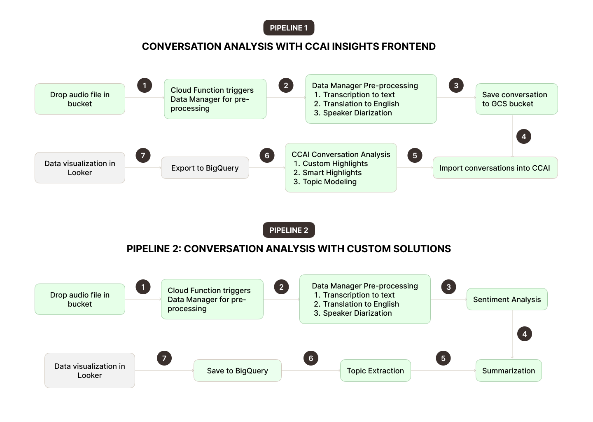

## The Pipelines



## Running development environment

#### Starting containers

To start the application containers:

```
docker compose up -d
```

To restart the application forcefully:

```
docker compose up -d --force-recreate
```

#### Sample Horizon Supervisor Config

```
[program:horizon]
process_name=%(program_name)s
command=php /var/www/ccai/data-manager/artisan horizon
autostart=true
autorestart=true
user=root
redirect_stderr=true
stdout_logfile=/var/www/horizon.log
stopwaitsecs=3600
```

#### Installing Python dependencies

This Python script leverages the Vertex AI API and the Gemini Pro model to transcribe audio files.

Prerequisites

- Google Cloud Project: A Google Cloud Project with the Vertex AI API enabled.
- Vertex AI Model: The Gemini Pro model (gemini-1.5-pro-preview-0514) deployed on your Vertex AI instance.
- Python Environment: Python 3.x with the following packages installed:

```
pip install vertexai
```

All Python scrits will be run in a subprocess using <a href="https://symfony.com/doc/current/components/process.html">
`symphony/Process`
</a> package

## CCAI Data Manager

This application provides management controls for raw audio files, their equivalent transcriptions and connects this data with Google APIs and AI services (Gemini, Vertex, STT, Looker Studio)

Capabilities

- Transcription via FasterWhisper (`scripts/transcribe.py`)
- Sync files on server disk with GCS bucket storage (`scripts/sync_to_bucket/init.sh`)
- Transcribe audio file with Gemini multimodal (`scripts/gemini.py`)
- Slice audio into 30 second pieces for Whisper model finetuning (`scripts/segments.py`)
- Transcription editor for transcript corrections
- Export entire dataset in HF format
- Integrated queue manager via Horizon

This management application is built with Laravel. Please read more information on their website.

## Sync files to CGS bucket

Gemini requires file paths referenced from a GCS bucket for transcription tasks. This requirement means we need a mechanism to syncs files from a specified location on the server disk to a GCP bucket.

This implementation uses Supervisor to maintain the syncing script uptime.

A Python script to perform this task is available at the following location:

```
scripts/sync_to_bucket/worker.py
```

The initialization script can be found here:

```
scripts/sync_to_bucket/init.sh
```

A template to configure Supervisor can be found here:

```
scripts/sync_to_bucket/supervisor-sync-to-bucket.conf
```

## Git Repository Management Notes

#### Removing local branches deleted from upstream server

1. Prune remote branches

```
git fetch -p
git branch -v
```

2. Delete local branches that don't exist on remote server

```
git for-each-ref --format '%(refname:short) %(upstream:track)' |
  awk '$2 == "[gone]" {print $1}' |
  xargs -r git branch -D
```

## API Documentation

#### Find a single data inventory entry from database

```bash
https://dashboard.ccai.pawait.io/api/v1/inventory?gs_link={GCS_BUCKET_LINK}
```

Replace `{GCS_LINK}` with the internal resource URL which you can access from GCS Bucket console interface.

## Contributing

Thank you for considering contributing to this project! Please speak to your line manager directly about getting access and tasks assigned to you.

## Security Vulnerabilities

If you discover a security vulnerability within this application, please send an e-mail to Nelson Ameyo via [nelson.ameyo@pawait.co.ke](mailto:nelson.ameyo@pawait.co.ke). All security vulnerabilities will be promptly addressed.
